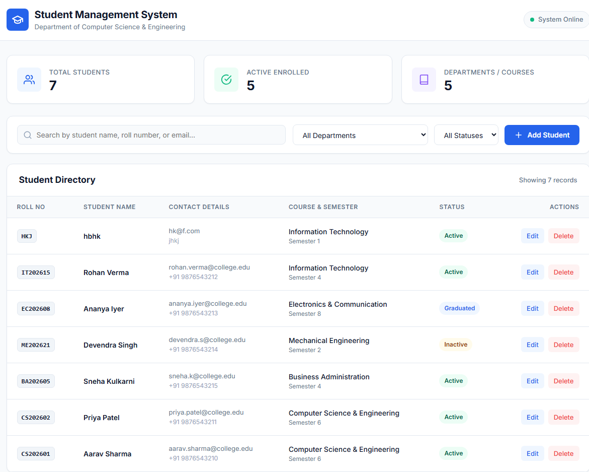
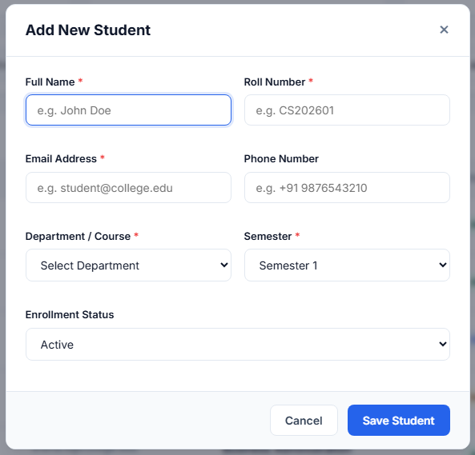

# Student Management System

> **Portfolio-Driven Assessment &bull; Full Stack Technologies (FST)**  
> **Course Assessment:** Mini Full Stack Web Application  
> **Submission Date:** October 1, 2026  
> **Live Demo:** [https://fst-aat-prathamreet-1nh23cs191.netlify.app/](https://fst-aat-prathamreet-1nh23cs191.netlify.app/)  
> **Repository:** [https://github.com/prathamreet/fst-aat](https://github.com/prathamreet/fst-aat)

---

## Executive Summary

The **Student Management System** is a complete, production-grade full stack web application developed as part of the Portfolio-Driven Assessment for the Full Stack Technologies curriculum. 

The application implements a centralized student directory to manage academic records, handle enrollments, and track departmental status. Built without frontend framework bloat, it directly demonstrates core full stack concepts: asynchronous client-server communication, modular RESTful API architecture, structured document-based database modeling with Mongoose, and serverless cloud deployment.

---

## Technology Stack

The project adheres strictly to the technologies prescribed in the assessment guidelines:

| Layer | Technology | Role & Implementation |
|---|---|---|
| **Frontend** | HTML5, CSS3, JavaScript (ES6+) | Semantic layout, custom design system, DOM manipulation, asynchronous Fetch API |
| **Backend** | Node.js, Express.js | Modular REST API, route handlers, error middleware, CORS handling |
| **Database** | MongoDB (Atlas), Mongoose ODM | Cloud document storage, strict schema validation, unique indexes, connection caching |
| **API Architecture** | RESTful HTTP API | Standardized JSON request/response payloads with HTTP status codes |
| **Version Control** | Git & GitHub | Feature branching, semantic commit history |
| **Deployment** | Netlify (Serverless) & Node.js | Dual-mode execution (local Express server + Netlify serverless functions via `serverless-http`) |

---

## System Architecture

```text
[ Browser / Client ]
      │
      │  HTTP Requests (JSON via Fetch API)
      ▼
[ Express REST API / Netlify Serverless Function ]
      │  ├── CORS & JSON Body Parsing
      │  ├── Input Validation & Duplicate Checks
      │  └── Route Controllers (/api/students)
      ▼
[ Mongoose ODM Layer ]
      │  ├── Student Schema & Validation Rules
      │  └── Connection Pool Caching
      ▼
[ MongoDB Atlas (Cloud NoSQL Database) ]
```

---

## Implementation of CRUD Operations

The core assessment requirement is end-to-end connectivity covering all four CRUD operations:

1. **Create (`POST /api/students`)**:
   - Client submits student information via an interactive modal form.
   - Backend validates required fields (Name, Roll No, Email, Course, Semester) and enforces unique roll numbers.
   - Record is persisted into MongoDB and returns HTTP `201 Created`.

2. **Read (`GET /api/students` & `GET /api/students/stats`)**:
   - Dynamic directory listing sorted chronologically (newest first).
   - Real-time debounced search by student name, roll number, or email.
   - Filterable by academic department and enrollment status (*Active*, *Inactive*, *Graduated*).
   - Aggregate statistics endpoint powers live KPI dashboard cards.

3. **Update (`PUT /api/students/:id`)**:
   - Pre-fills modal dialogue with existing student metadata.
   - Validates uniqueness constraint if roll number is modified.
   - Atomic update via `findByIdAndUpdate` with schema validators active.

4. **Delete (`DELETE /api/students/:id`)**:
   - Protected with a two-step confirmation dialogue to prevent accidental deletion.
   - Permanently deletes document from the MongoDB collection and returns immediate UI feedback.

---

## Data Model (Mongoose Schema)

```javascript
{
  name:      { type: String, required: true, trim: true },
  rollNo:    { type: String, required: true, unique: true, uppercase: true },
  email:     { type: String, required: true, lowercase: true, trim: true },
  course:    { type: String, required: true },
  semester:  { type: String, required: true, default: 'Semester 1' },
  phone:     { type: String, default: '' },
  status:    { type: String, enum: ['Active', 'Inactive', 'Graduated'], default: 'Active' },
  timestamps: true // createdAt, updatedAt
}
```

---

## REST API Specification

| Method | Endpoint | Description | Status Codes |
|---|---|---|---|
| `GET` | `/api/students` | Retrieve all student records (supports `search`, `course`, `status` query params) | `200`, `500` |
| `GET` | `/api/students/stats` | Retrieve aggregate metrics (total, active, departments) | `200`, `500` |
| `GET` | `/api/students/:id` | Retrieve single student by MongoDB ID | `200`, `404`, `500` |
| `POST` | `/api/students` | Register a new student record | `201`, `400`, `500` |
| `PUT` | `/api/students/:id` | Update an existing student record | `200`, `400`, `404`, `500` |
| `DELETE` | `/api/students/:id` | Remove a student record | `200`, `404`, `500` |
| `GET` | `/api/health` | Health-check endpoint reporting server uptime & DB connection status | `200` |

---

## Project Structure

```text
fst-aat/
├── config/
│   └── db.js                 # MongoDB connection logic with connection caching & DNS fallback
├── doc/
│   └── teacher-task.md       # Assessment guidelines and submission criteria
├── models/
│   └── Student.js            # Mongoose Schema definition and model exports
├── netlify/
│   └── functions/
│       └── api.js            # Netlify Serverless HTTP function wrapper
├── public/                   # Frontend assets (Static client)
│   ├── css/
│   │   └── style.css         # Clean, authentic UI styling (Inter font, responsive grid)
│   ├── js/
│   │   └── app.js           # Client controller (Fetch API, DOM events, modal state, toast alerts)
│   └── index.html            # Main dashboard interface
├── routes/
│   └── studentRoutes.js      # REST API route handlers and business logic
├── .env                      # Local environment configuration (git-ignored)
├── .env.example              # Template configuration for deployment reference
├── .gitignore                # Rules to prevent committing node_modules, keys, or build artifacts
├── netlify.toml              # Netlify build configuration & API rewrite redirects
├── package.json              # Project metadata, dependencies, and execution scripts
├── seed.js                   # Automated database seeder with sample academic records
├── server.js                 # Express server entry point for local and traditional hosting
└── README.md                 # Complete project documentation and submission report
```

---

## Local Setup & Installation

### 1. Prerequisites
- **Node.js** (v18 or higher recommended)
- **Git**
- **MongoDB** (Local instance or free MongoDB Atlas cluster)

### 2. Clone the Repository
```bash
git clone https://github.com/prathamreet/fst-aat.git
cd fst-aat
```

### 3. Install Dependencies
```bash
npm install
```

### 4. Configure Environment Variables
Create a `.env` file in the root directory (refer to `.env.example`):
```env
PORT=5000
MONGODB_URI=mongodb+srv://<username>:<password>@cluster0.l0azrdn.mongodb.net/student_db?retryWrites=true&w=majority
```

### 5. Seed Initial Data (Optional)
To instantly populate the database with realistic sample records:
```bash
npm run seed
```

### 6. Run the Application
For standard execution:
```bash
npm start
```
For development with hot-reload:
```bash
npm run dev
```

Visit the application at: `http://localhost:5000`

---

## Cloud Deployment (Netlify + MongoDB Atlas)

- **Live Production URL:** [https://fst-aat-prathamreet-1nh23cs191.netlify.app/](https://fst-aat-prathamreet-1nh23cs191.netlify.app/)
- **Repository:** [https://github.com/prathamreet/fst-aat](https://github.com/prathamreet/fst-aat)

The project includes built-in compatibility for Netlify via [netlify.toml](netlify.toml) and serverless function handlers:

1. **Repository Setup**: Push repository to GitHub.
2. **Netlify Project Creation**: Link GitHub repo to a new Netlify site.
3. **Build Settings**: Automatically configured by `netlify.toml`:
   - Publish directory: `public`
   - Functions directory: `netlify/functions`
4. **Environment Variables**:
   - Add `MONGODB_URI` with the MongoDB Atlas connection string under Netlify **Site configuration &rarr; Environment variables**.
5. **MongoDB Network Whitelist**:
   - In MongoDB Atlas, verify **Network Access** allows `0.0.0.0/0` (Access from Anywhere) so Netlify serverless functions can establish connections.

---

## Verification & Output Screenshots

### Live Production Dashboard


### Student Enrollment & Validation Modal


| Feature | Verified Behavior |
|---|---|
| **Database Connectivity** | Live connection to MongoDB Atlas with connection status indicator |
| **Data Creation** | Modal form validation, duplicate roll-number prevention, immediate table refresh |
| **Data Retrieval** | Instant table population, search debouncing, multi-criteria filtering |
| **Data Modification** | In-place pre-populated modal, immediate persistence |
| **Data Removal** | Safe deletion workflow with user confirmation and auto-dismissing toast notifications |
| **Responsive Design** | Desktop, tablet, and mobile viewport compatibility |

---

## Assessment Compliance Checklist

- [x] Full Stack Architecture (Frontend + Backend + Database)
- [x] Frontend: Semantic HTML5, CSS3, Vanilla JavaScript (Fetch API)
- [x] Backend: Node.js + Express.js REST API
- [x] Database: MongoDB Atlas with Mongoose ODM
- [x] CRUD Operations: Create, Read, Update, Delete completely functional
- [x] Version Control: Managed via Git with repository hosted on GitHub
- [x] Deployment: Configured for Netlify Serverless Cloud hosting
- [x] Submission Deliverables: Source code, documentation, API specs, and clean commit history
