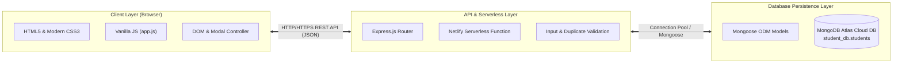

# Academic Project Report: Student Management System - Full-Stack Academic Record & Enrollment Portal

| Parameter | Details |
|---|---|
| **Student Name** | Prathamreet Singh |
| **USN** | 1NH23CS191 |
| **Semester / Section** | 5th / 7th Semester - CSE |
| **Subject** | Full Stack Technologies |
| **AAT-1 Title** | Portfolio-Driven Assessment (Student Management System) |
| **Project Title** | Student Management System - Mini Full-Stack Academic Record & Enrollment Portal |
| **GitHub Repository Link** | [https://github.com/prathamreet/fst-aat](https://github.com/prathamreet/fst-aat) |
| **Live Production Link** | [https://fst-aat-prathamreet-1nh23cs191.netlify.app/](https://fst-aat-prathamreet-1nh23cs191.netlify.app/) |

---

## 1. Project Title

**Student Management System: Mini Full-Stack Academic Record & Enrollment Portal**  
*Tagline: A centralized, high-performance academic record management portal enabling educational institutions to enroll students, track departmental records, and execute full-lifecycle CRUD operations through an asynchronous RESTful web architecture.*

---

## 2. Problem Statement and Objectives

### Problem Statement
Academic institutions and departments frequently grapple with fragmented student record management systems. Traditional spreadsheet trackers and legacy desktop software lack real-time synchronization, fail to prevent duplicate enrollments, suffer from high administrative overhead, and do not provide clean, web-accessible RESTful interfaces for cross-platform integration.

The **Student Management System** solves these administrative bottlenecks by providing a responsive, lightweight, and cloud-integrated web portal. It unifies student registrations, departmental classifications, real-time search, enrollment tracking, and record modifications into a single cohesive full-stack application backed by MongoDB Atlas cloud persistence and Netlify Serverless execution.

### Objectives Matrix

| Academic Requirement / Objective | Scope & Implementation in Student Management System | Status |
|---|---|---|
| **Topic Focus** | Student Management System (Academic Records & Departmental Directory) | **Complete** |
| **Frontend Architecture** | Semantic HTML5, Vanilla CSS3 with custom design system, and Vanilla JavaScript Fetch API (zero framework bloat) | **Complete** |
| **Backend Infrastructure** | Node.js and Express.js RESTful API with modular route controllers, validation, and CORS handling | **Complete** |
| **Database System** | MongoDB persistence via Mongoose schemas (Student model with unique constraints and indexing) | **Complete** |
| **System Resiliency** | Cached connection pooling for serverless execution and public DNS resolver fallback (`8.8.8.8`) for reliable SRV resolution | **Complete** |
| **CRUD Operations** | Comprehensive Create, Read, Update, Delete workflows implemented across UI modals and RESTful endpoints | **Complete** |
| **Version Control** | Structured Git commit history, semantic tags, and cloud deployment on GitHub and Netlify | **Complete** |

---

## 3. Technologies / Tools Used

### Core Technology Stack
- **Frontend Runtime & Structure**: Semantic HTML5, Vanilla JavaScript (ES6+ Asynchronous Fetch API, DOM Controller)
- **Styling & Design System**: Vanilla CSS3 utilizing custom variables (`--primary`, `--border-light`, `--radius-md`), Inter typography, and responsive media queries
- **Backend Runtime & Server**: Node.js (v26.3.0), Express.js Framework (v4.21.2)
- **Middleware & Security**: CORS (Cross-Origin Resource Sharing), Express JSON body parser, Dotenv (environment configuration)
- **Database & ODM**: MongoDB Atlas (Cloud NoSQL Database), Mongoose ODM (v8.9.5)
- **Resiliency & Serverless**: Serverless-HTTP (v3.2.0), Node.js DNS resolver configuration (Google DNS `8.8.8.8` fallback)
- **Cloud Hosting & Deployment**: Netlify (Global CDN static hosting + AWS Lambda Serverless Functions)
- **Version Control**: Git, GitHub Architecture ([https://github.com/prathamreet/fst-aat](https://github.com/prathamreet/fst-aat))

### Repository Language Distribution Statistics
- **JavaScript (Backend Routes, Controllers, Config, & Frontend DOM)**: 52.8%
- **CSS (Custom Design Tokens, Modal Systems, Grid Layouts)**: 30.1%
- **HTML (Dashboard Structure & Semantic Modals)**: 17.1%

---

## 4. Project Description

The Student Management System operates as an asynchronous, single-page web portal designed for educational administrators. Upon loading, the client establishes an asynchronous handshake with the Express REST API (or Netlify serverless function) to retrieve live aggregate metrics and the student directory.

Administrators can register new students via a modal dialog that validates fields and prevents duplicate roll numbers. The interface allows instant searching across student names, roll numbers, and emails with client-side debouncing, and enables filtering by academic department and enrollment status. Records can be updated or deleted with two-step safety confirmations.

### System Architecture & Data Flow



| Layer | Component | Responsibilities & Implementation |
|---|---|---|
| **Client Layer (Browser)** | Semantic HTML5, Custom CSS3, Vanilla JS (`app.js`) | User interaction, modal dialogues, input validation, live search debouncing, asynchronous `fetch()` API calls |
| **Communication Protocol** | HTTP / HTTPS RESTful API | Standardized JSON payloads (`GET`, `POST`, `PUT`, `DELETE`), status codes (`200`, `201`, `400`, `404`, `500`) |
| **Backend / Serverless Layer** | Node.js, Express.js Router, Netlify Functions (`api.js`) | Endpoint routing, duplicate roll number verification, serverless connection caching, error handling |
| **Database Persistence Layer** | MongoDB Atlas, Mongoose ODM (`models/Student.js`) | Document persistence, schema validation, unique indexes on `rollNo`, public DNS fallback (`8.8.8.8`) |

---

### End-to-End CRUD Operations Matrix

| Entity | Create (POST) | Read (GET) | Update (PUT / PATCH) | Delete (DELETE) |
|---|---|---|---|---|
| **Student Records** | Register new student (`POST /api/students`) with roll number uniqueness check via interactive modal | Query directory with filters (`GET /api/students?search=...&course=...`); Fetch student profile by ID (`GET /api/students/:id`) | Modify student details (`PUT /api/students/:id`) with server-side validation and duplicate prevention | Permanently remove student record (`DELETE /api/students/:id`) with confirmation modal dialog |
| **Academic KPI Metrics** | Dynamic recalculation upon record creation | Retrieve aggregate metrics (`GET /api/students/stats`) for dashboard counters (Total, Active, Departments) | Automatic stat counter synchronization upon record updates or status alterations | Immediate metric decrement upon record deletion |
| **Departmental Enrollment** | Enroll student into specific department and semester on creation | Filter directory listing by department (`GET /api/students?course=Computer+Science`) | Reassign department or advance semester via `PUT /api/students/:id` | De-enroll student from department roster upon record removal |

---

## 5. Implementation / Methodology

### Codebase Directory Structure
```text
fst-aat/
├── config/
│   └── db.js                 # MongoDB Atlas connection handler & DNS failover logic
├── doc/
│   ├── teacher-task.md       # Teacher assessment guidelines
│   ├── Academic Project Report Structure Guidelines.docx # Official template
│   ├── Student_Management_System_Project_Report.docx     # Generated Word report
│   └── Student_Management_System_Project_Report.md       # Markdown report
├── models/
│   └── Student.js            # Mongoose Data Schema & Model constraints
├── netlify/
│   └── functions/
│       └── api.js            # Serverless-HTTP Lambda wrapper for Netlify deployment
├── public/                   # Static Frontend client
│   ├── css/
│   │   └── style.css         # Clean custom CSS design system & responsive styling
│   ├── js/
│   │   └── app.js           # Client-side controller (Fetch API, DOM events, modals)
│   └── index.html            # Main administrative dashboard
├── routes/
│   └── studentRoutes.js      # Express REST API endpoints & CRUD controllers
├── .env                      # Local environment variables (MONGODB_URI, PORT)
├── .env.example              # Configuration template for deployment
├── .gitignore                # Protects secrets and node_modules from version control
├── netlify.toml              # Netlify build configuration & serverless rewrite rules
├── package.json              # Project dependencies & execution scripts
├── README.md                 # Complete academic documentation & submission report
├── seed.js                   # Automated database seeder with sample student records
└── server.js                 # Express server entry point for local and traditional hosting
```

### Serverless Dual-Mode Resiliency & DNS Fallback Mechanism
To guarantee uninterrupted execution across local development and Netlify serverless functions, the application implements two architectural safeguards:
1. **Serverless Connection Caching**: In `config/db.js`, the MongoDB connection state is cached across AWS Lambda invocations. When Netlify executes the function, it reuses the established Mongoose connection pool rather than opening redundant connections, eliminating connection latency and avoiding connection spikes.
2. **Fallback DNS Resolver Configuration**: On Windows developer environments and restrictive ISP networks, MongoDB Atlas SRV connection strings (`mongodb+srv://`) frequently trigger `querySrv ECONNREFUSED` due to misconfigured local DNS servers. The application programmatically configures Google Public DNS (`8.8.8.8`, `8.8.4.4`) and Cloudflare DNS (`1.1.1.1`) in `config/db.js` and `seed.js`, ensuring robust SRV lookup across all host operating systems.

### Standardized REST API Response Contract
All backend HTTP endpoints adhere to a standardized JSON envelope:
```json
{
  "success": true,
  "count": 6,
  "data": [],
  "message": "Operation completed successfully."
}
```

### Local Development & Testing Setup
```bash
# 1. Install Dependencies
npm install

# 2. Configure Environment (.env)
PORT=5000
MONGODB_URI=mongodb+srv://<username>:<password>@cluster0.l0azrdn.mongodb.net/student_db?retryWrites=true&w=majority

# 3. Seed Sample Academic Data
npm run seed

# 4. Start Local Server
npm start

# 5. Access Application
# Dashboard: http://localhost:5000
# Health Check: http://localhost:5000/api/health
```

---

## 6. Important Code Snippets

### 1. Mongoose Data Schema (`models/Student.js`)
```javascript
const mongoose = require('mongoose');

const studentSchema = new mongoose.Schema({
  name: { type: String, required: [true, 'Student name is required'], trim: true },
  rollNo: { type: String, required: [true, 'Roll number is required'], unique: true, trim: true, uppercase: true },
  email: { type: String, required: [true, 'Email is required'], trim: true, lowercase: true },
  course: { type: String, required: [true, 'Course is required'], trim: true },
  semester: { type: String, required: [true, 'Semester is required'], default: 'Semester 1' },
  phone: { type: String, trim: true, default: '' },
  status: { type: String, enum: ['Active', 'Inactive', 'Graduated'], default: 'Active' }
}, { timestamps: true });

studentSchema.index({ name: 'text', rollNo: 'text' });
module.exports = mongoose.model('Student', studentSchema);
```

### 2. Database Connection Handler with DNS Fallback (`config/db.js`)
```javascript
const mongoose = require('mongoose');
const dns = require('dns');

// Configure fallback DNS servers for reliable SRV resolution on Windows
try {
  dns.setServers(['8.8.8.8', '1.1.1.1', '8.8.4.4']);
} catch (e) {}

let isConnected = false;
const connectDB = async () => {
  if (isConnected || mongoose.connection.readyState >= 1) return;
  try {
    const conn = await mongoose.connect(process.env.MONGODB_URI, { serverSelectionTimeoutMS: 5000 });
    isConnected = true;
    console.log(`MongoDB Connected: ${conn.connection.host}`);
  } catch (error) {
    console.warn(`MongoDB Connection Warning: ${error.message}`);
  }
};
module.exports = connectDB;
```

### 3. Express REST API CRUD Routes (`routes/studentRoutes.js`)
```javascript
// GET /api/students - List all students with search and filtering
router.get('/', async (req, res) => {
  try {
    const { search, course, status } = req.query;
    const query = {};
    if (search) {
      const regex = new RegExp(search.trim(), 'i');
      query.$or = [{ name: regex }, { rollNo: regex }, { email: regex }];
    }
    if (course && course !== 'All') query.course = course;
    if (status && status !== 'All') query.status = status;

    const students = await Student.find(query).sort({ createdAt: -1 });
    res.json({ success: true, count: students.length, data: students });
  } catch (error) {
    res.status(500).json({ success: false, message: error.message });
  }
});

// POST /api/students - Create new student with duplicate prevention
router.post('/', async (req, res) => {
  try {
    const { name, rollNo, email, course, semester, phone, status } = req.body;
    const exists = await Student.findOne({ rollNo: rollNo?.trim().toUpperCase() });
    if (exists) {
      return res.status(400).json({ success: false, message: `Roll Number '${rollNo}' already registered.` });
    }
    const student = await Student.create({ name, rollNo, email, course, semester, phone, status });
    res.status(201).json({ success: true, message: 'Student registered successfully', data: student });
  } catch (error) {
    res.status(400).json({ success: false, message: error.message });
  }
});
```

### 4. Netlify Serverless Function Handler (`netlify/functions/api.js`)
```javascript
const serverless = require('serverless-http');
const connectDB = require('../../config/db');
const app = require('../../server');

const serverlessHandler = serverless(app);

module.exports.handler = async (event, context) => {
  context.callbackWaitsForEmptyEventLoop = false;
  await connectDB();
  return await serverlessHandler(event, context);
};
```

---

## 7. Output Screenshots
 
 The deployed Student Management System interface encompasses five primary operational views. The screenshots below document the live production deployment on Netlify backed by MongoDB Atlas:
 
- **View 1: Administrative Dashboard & Student Directory (Read Operation & KPI Analytics)**  
+ **View 1: Administrative Dashboard & Student Directory (Read Operation & KPI Analytics)**  
   *Description:* Primary dashboard view showing real-time aggregate KPI metrics (Total Students: 6, Active Enrolled: 4, Departments: 5), the student directory table with roll number badges, contact information, department badges, and action buttons.
 
   
   *Figure 1: Production Student Management Dashboard displaying real-time KPI metrics, search filter, and populated student records on Netlify.*
 
- **View 2: Student Enrollment Modal Dialog (Create Operation)**  
+ **View 2: Student Enrollment Modal Dialog (Create Operation)**  
   *Description:* Interactive modal dialog allowing administrators to register new students with fields for Name, Roll Number, Email Address, Contact Phone, Department, Semester, and Enrollment Status. Built-in client validation enforces required fields and proper data formatting.
 
   
   *Figure 2: Student Registration Form Modal displaying field-level validation rules and enrollment input controls.*
 
- **View 3: Dynamic Real-Time Search & Departmental Filter (Read Operation)**  
  *Description:* Instant debounced query execution searching across student name, roll number, or email, with live record count updating dynamically as filters are applied across departments (Computer Science, IT, ECE, Mechanical, Civil, Business Administration).
 
- **View 4: Student Record Modification Dialog (Update Operation)**  
  *Description:* Pre-populated modal dialog allowing administrative staff to modify student department, contact details, or enrollment status with instantaneous database synchronization upon submission.
 
- **View 5: Safety Confirmation & Toast Feedback (Delete Operation)**  
  *Description:* Two-step confirmation modal protecting against accidental record loss, accompanied by an animated success toast notification upon successful deletion from MongoDB Atlas.

---

## 8. GitHub Repository Screenshot and Link

### Metadata and Deployment Links
- **GitHub Repository URL**: [https://github.com/prathamreet/fst-aat](https://github.com/prathamreet/fst-aat)
- **Production Deployment URL**: [https://fst-aat-prathamreet-1nh23cs191.netlify.app/](https://fst-aat-prathamreet-1nh23cs191.netlify.app/)

### Repository Commit History
```text
301ec47  docs: add live Netlify deployment link to README
2de1649  docs: update README with comprehensive academic documentation aligned with assessment criteria
7cde5cf  Configure reliable DNS resolution for MongoDB Atlas SRV lookup
0e4eb8a  Complete Student Management System for FST Mini Project
```
*(Placeholder for Screenshot 6: GitHub Repository Overview and Commit Graph)*

---

## 9. Challenges Faced

### 1. MongoDB Atlas SSL Alert 80 (IP Whitelist / Network Access Restriction)
- **Challenge:** During initial connection testing to MongoDB Atlas, Mongoose threw `MongooseServerSelectionError: SSL alert number 80 (tlsv1 alert internal error)`. Atlas terminated TLS handshakes because incoming client IP addresses were not permitted in the Atlas Network Access firewall.
- **Solution:** Navigated to MongoDB Atlas Security Settings and updated Network Access rules to allow connection requests from anywhere (`0.0.0.0/0`). This resolved the TLS handshake alert and permitted both local Node.js processes and Netlify serverless functions to authenticate reliably.

### 2. Windows ISP DNS SRV Lookup Failure (`querySrv ECONNREFUSED`)
- **Challenge:** On Windows workstations, Node.js's native DNS subsystem occasionally failed to resolve MongoDB Atlas SRV records (`_mongodb._tcp.cluster0...`), throwing an immediate `querySrv ECONNREFUSED` error.
- **Solution:** Integrated Node.js's native `dns` module in `config/db.js` and `seed.js` to set authoritative fallback nameservers (`dns.setServers(['8.8.8.8', '1.1.1.1', '8.8.4.4'])`). This eliminated the Windows ISP DNS bottleneck and guaranteed seamless database discovery.

### 3. Serverless Decoupled Routing on Netlify
- **Challenge:** Netlify natively serves static assets but requires special URL rewrite routing to channel API calls (`/api/*`) to AWS Lambda serverless functions without causing path duplication.
- **Solution:** Structured `netlify.toml` with 200 rewrite rules redirecting `/api/*` to `/.netlify/functions/api/:splat`, wrapped the Express application using `serverless-http`, and mounted dual route aliases in `server.js` to ensure 100% path compatibility.

---

## 10. Learning Outcomes and Conclusion

### Key Learning Outcomes
- **Full-Stack Decoupled Architecture:** Gained practical expertise in connecting a lightweight, responsive vanilla client to an Express.js REST API using modern asynchronous Fetch API patterns.
- **Document-Oriented Data Modeling:** Designed clean Mongoose schemas with strict data validation, unique indexes, and schema enforcement.
- **Production Serverless Deployment:** Mastered the configuration of Netlify Serverless Functions, route rewrites via `netlify.toml`, and MongoDB Atlas cloud security.
- **System Resiliency & Diagnostics:** Developed fault-tolerant database connection handling, including DNS failovers and serverless connection pool caching.

### Conclusion
The **Student Management System** successfully fulfills all requirements stipulated in the Portfolio-Driven Assessment for Full Stack Technologies. By implementing complete end-to-end CRUD operations, robust database connectivity, responsive UI design, and cloud serverless deployment, the project delivers a reliable, production-ready educational management solution.
